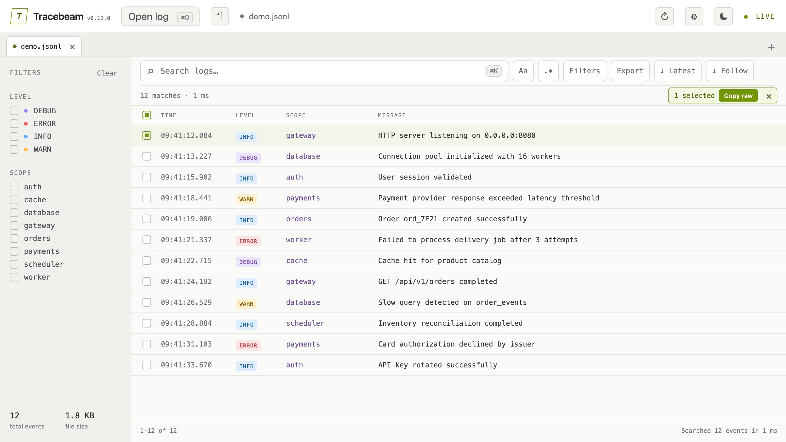

# Tracebeam

A lightweight, cross-platform desktop viewer for continuously growing JSONL logs. The Rust core incrementally indexes appended lines; the UI provides fast text/regex search, structured field and time filters, surrounding context, full-result export, invalid JSON diagnostics, virtual scrolling, live refresh, and structured JSON inspection.



The screenshot uses [`examples/demo.jsonl`](examples/demo.jsonl). While developing, open `http://127.0.0.1:1420/?demo` to reproduce the preview without the desktop file picker.

## Development

```bash
pnpm install
pnpm dev
```

Each line should contain one JSON object. Tracebeam recognizes `timestamp`/`time`/`ts`, `level`/`severity`, `scope`/`namespace`/`module`, and `message`/`msg` automatically while keeping all other metadata available in the detail view.

## Querying and diagnostics

- Open **Filters** to combine nested field conditions such as `http.status >= 500`, a local time range, and up to 100 surrounding context lines.
- Hover or keyboard-focus a JSON field to open its inline filter menu; long values wrap without moving the action rail, and array paths such as `items.0.status` are supported.
- Context rows are visually muted and help explain a match; **Export** writes every direct match, without context-only rows, to JSONL or CSV.
- Malformed non-empty lines remain visible as `INVALID`, retain their physical line number and parser error, and can be isolated from the sidebar diagnostic.
